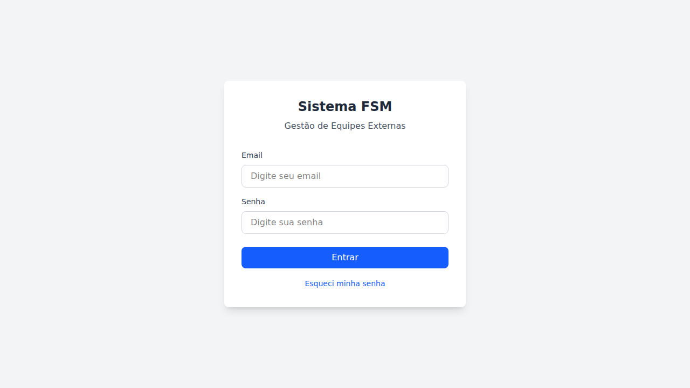
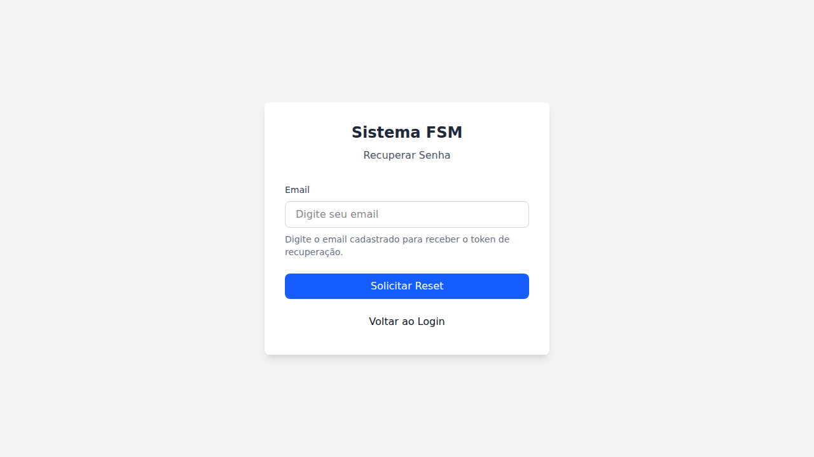
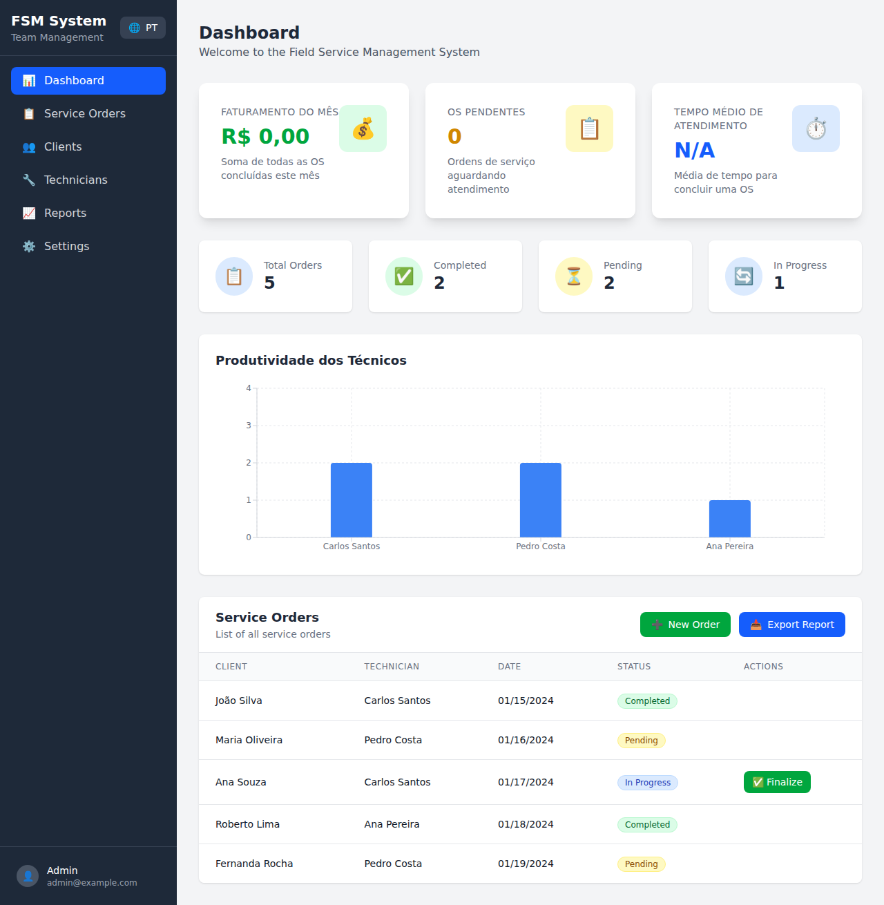
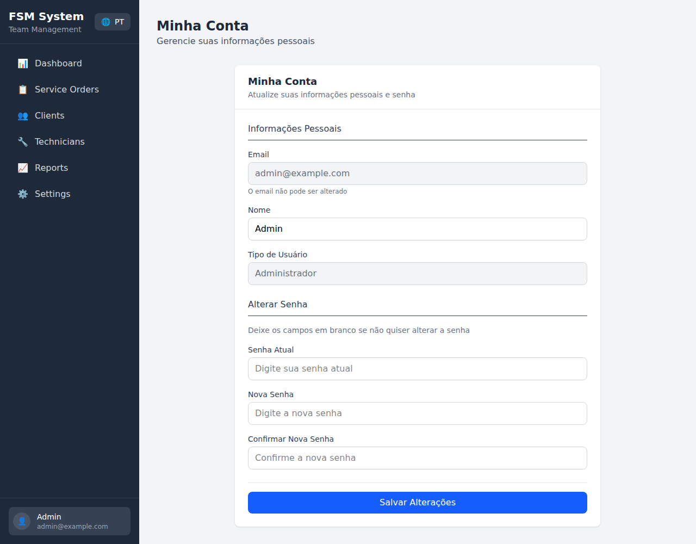

# Documentação Visual do Sistema FSM (Field Service Management)

Este documento apresenta as principais telas do Sistema de Gestão de Equipes Externas, desenvolvido para gerenciar ordens de serviço, técnicos e clientes de forma eficiente.

---

## 1. Tela de Login

### Descrição
A tela de login é a porta de entrada do sistema, onde os usuários autenticam suas credenciais para acessar as funcionalidades da plataforma.

### Características Principais
- **Design limpo e intuitivo**: Interface minimalista que facilita o acesso rápido ao sistema
- **Campos de autenticação**: Email e senha para validação do usuário
- **Botão "Entrar"**: Submete as credenciais para autenticação via API
- **Link "Esqueci minha senha"**: Permite recuperação de senha em caso de esquecimento
- **Identidade visual**: Logo e subtítulo "Gestão de Equipes Externas" reforçam o propósito do sistema

### Aspectos Técnicos
- Validação de campos obrigatórios
- Integração com API REST para autenticação JWT
- Armazenamento seguro do token de sessão

---

## 2. Tela de Recuperação de Senha

### Descrição
Esta tela permite que usuários que esqueceram suas credenciais solicitem um token de recuperação de senha por email.

### Características Principais
- **Campo de email**: O usuário informa o email cadastrado no sistema
- **Instruções claras**: Texto explicativo orienta o usuário sobre o processo
- **Botão "Solicitar Reset"**: Envia a solicitação de recuperação para o servidor
- **Botão "Voltar ao Login"**: Permite retornar à tela de autenticação

### Fluxo de Recuperação
1. Usuário insere o email cadastrado
2. Sistema envia um token de recuperação por email
3. Usuário utiliza o token para redefinir a senha

---

## 3. Dashboard Principal

### Descrição
O Dashboard é a tela central do sistema, oferecendo uma visão geral e consolidada de todas as operações de field service.

### Seções do Dashboard

#### Menu Lateral (Sidebar)
- **Dashboard**: Visão geral do sistema
- **Service Orders**: Gestão de ordens de serviço
- **Clients**: Cadastro e gestão de clientes
- **Technicians**: Gestão de técnicos de campo
- **Reports**: Relatórios gerenciais
- **Settings**: Configurações do sistema

#### Cards de Métricas (Topo)
- **Faturamento do Mês**: Valor total das OS concluídas no período
- **OS Pendentes**: Quantidade de ordens aguardando atendimento
- **Tempo Médio de Atendimento**: Indicador de eficiência operacional

#### Estatísticas de Ordens
- **Total Orders**: Total de ordens no sistema
- **Completed**: Ordens finalizadas com sucesso
- **Pending**: Ordens aguardando início
- **In Progress**: Ordens em andamento

#### Gráfico de Produtividade
- Visualização em barras da produtividade individual de cada técnico
- Permite identificar os profissionais mais produtivos
- Base para decisões de alocação de recursos

#### Tabela de Ordens de Serviço
- Lista detalhada de todas as ordens
- Colunas: Cliente, Técnico, Data, Status, Ações
- **Botão "New Order"**: Criar nova ordem de serviço
- **Botão "Export Report"**: Exportar dados em formato CSV
- **Botão "Finalize"**: Finalizar ordens em andamento

### Aspectos Técnicos
- Atualização em tempo real via WebSocket (Socket.IO)
- Gráficos interativos com biblioteca Recharts
- Suporte a internacionalização (i18n) - Português/Inglês

---

## 4. Tela Minha Conta

### Descrição
Esta tela permite que o usuário gerencie suas informações pessoais e credenciais de acesso ao sistema.

### Seções da Tela

#### Informações Pessoais
- **Email**: Campo somente leitura (não editável por questões de segurança)
- **Nome**: Nome completo do usuário, editável
- **Tipo de Usuário**: Perfil de acesso (Administrador, Técnico, etc.)

#### Alterar Senha
- **Senha Atual**: Validação de identidade antes da alteração
- **Nova Senha**: Campo para definir a nova senha
- **Confirmar Nova Senha**: Confirmação para evitar erros de digitação
- **Instrução**: "Deixe os campos em branco se não quiser alterar a senha"

### Características de Segurança
- Validação da senha atual antes de permitir alterações
- Campos de senha com máscara de caracteres
- Confirmação de senha para evitar erros
- Botão "Salvar Alterações" para confirmar as mudanças

---

## Tecnologias Utilizadas

### Frontend
- **React 19**: Biblioteca JavaScript para construção de interfaces
- **Vite**: Build tool e dev server de alta performance
- **Tailwind CSS**: Framework CSS utilitário para estilização
- **React-i18next**: Internacionalização (suporte a múltiplos idiomas)
- **Recharts**: Biblioteca para criação de gráficos
- **Socket.IO Client**: Comunicação em tempo real

### Backend
- **Node.js**: Runtime JavaScript no servidor
- **Express/Fastify**: Framework para API REST
- **Prisma**: ORM para banco de dados
- **PostgreSQL**: Banco de dados relacional
- **JWT**: Autenticação baseada em tokens

### Infraestrutura
- **Docker**: Containerização da aplicação
- **Docker Compose**: Orquestração de containers

---

## Conclusão

O Sistema FSM foi desenvolvido com foco em usabilidade, performance e escalabilidade. A interface intuitiva permite que gestores e técnicos de campo operem de forma eficiente, enquanto os dashboards e relatórios fornecem insights valiosos para tomada de decisões estratégicas.

O sistema suporta operações críticas como:
- Gestão completa do ciclo de vida das ordens de serviço
- Acompanhamento em tempo real da produtividade
- Controle de acesso baseado em perfis
- Exportação de dados para análise externa

---

*Documentação gerada para fins acadêmicos - Sistema de Gestão de Equipes Externas (FSM)*
